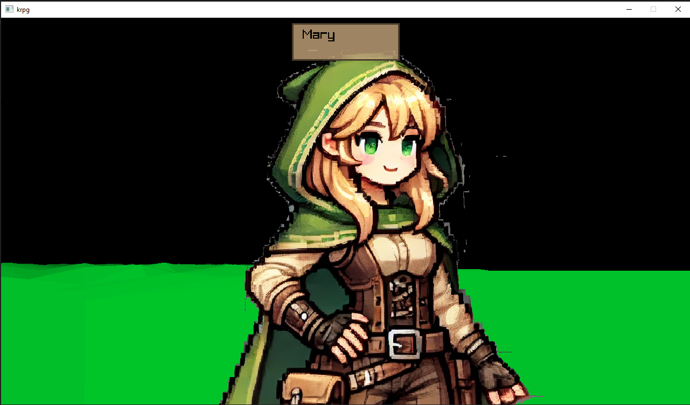

# krpg

## Overview

krpg is a simple old school rpg, imagined in the vein of Daggerfall.

Very early development.

The main purpose of this project is to teach myself zig. Because of this, do not expect great zig code.

## Building

Project currently uses zig v0.14

The game project is in the [game](./game/) folder, do a **zig build run** there.

The editor project is in the [editor](./editor/) folder, do a **zig build run** there.

## Game Controls

|Control| Function|
|--|--|
|WASD|Walking|
|Mouse|Look|
| e| interact|
|~|Console|

### Console comands 
|Control| Function|
|--|--|
|LOCATION X Y| WARP to X,Y position|

## Credits

### Game Library
[raylib](https://www.raylib.com/)

